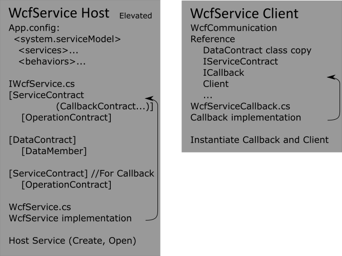

## ADT

For PTR Manual go [here](README.md).
____________________________________
ADT stands for Active Directory Tracker. This is a folder access rights tracking service. It reads folders and set's up FileSystemWatchers for tracked folders and writes all changes to PTR database. Service (ADTService) comes with a client (ADTManager) to observe and debug it's work. The communication between service and a client is is made via WCF services.

The ADTManager application is made in MVVM pattern. The ManagerWindow context is a ManagerViewModel which manages the ServerViemodels (Loading config, Adding new or removing old ServerViewModels, Saving config and watching for config changes). ServerViewModels do organize connection with it's servers service and launches SettingsWindow with SettingsViewModel in context. SettingsViewModel exposes service attributes and applies changes if necessary.

### WCF Duplex Communication

ADT has a duplex communication. ADTService is hosting a Wcf service and ADTManager has a Wcf client, to communicate together.

>Here are two tutorials for [Hosting a WCF Service in a Managed Windows Service][1] and [A Simple Duplex Service in WCF][2]. First one is a part of a more detailed tutorial on setting up a Windows Service and a console application communication. Second one has a very valuable duplex communication config file.

On this scheme are mentioned files and references that were involved in creating that duplex communication.

First thing were created IWcfService.cs. It contains Service Contract with all operation contracts (in reality they are just interfaces) that define which methods are to be called on host by the client (in this case client will call Connect and Disconnect on the host). Then Data Contract with it's Data Members that define the seriallizable object that is going to be sent back and/or forth by client and host in their communication (in this case a host will send it's consoles cache to a client). Another Service Contract with Operation Contracts is a Callback Contract mentioned in first contract attribute. The callback works just the same as the first one just in a different direction. Callback lets host to call things on a client (WriteConsole and SettingsChanged in our case).

In WcfService.cs whe WcfService gets implemented (Connect and Disconnect code). 

To make things work we need to host WcfService in ADTService. And to do that easier we need to configure it in App.config. So in ADTWindowsService we just need to instantiate and try Open the host.

On a client's side we need to get the reference of the WcfService that is running elevated. When client get's reference, the Callback should be implemented with referenced interface (It get's copied, you should not reference WcfService). 

To make things happen on a client's side you should instantiate a client and try Open it. A client and host will start communicating.

[1]:https://msdn.microsoft.com/en-us/library/ms733069.aspx
[2]:http://www.c-sharpcorner.com/uploadfile/dhananjaycoder/a-simple-duplex-service-in-wcf/

### 